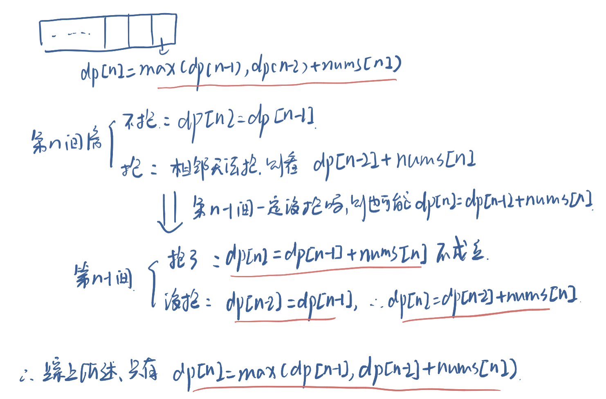

### 0213. 打家劫舍 II

#### 题目地址：https://leetcode-cn.com/problems/house-robber-ii/

你是一个专业的小偷，计划偷窃沿街的房屋，每间房内都藏有一定的现金。这个地方所有的房屋都 **围成一圈** ，这意味着第一个房屋和最后一个房屋是紧挨着的。同时，相邻的房屋装有相互连通的防盗系统，**如果两间相邻的房屋在同一晚上被小偷闯入，系统会自动报警 。**

给定一个代表每个房屋存放金额的非负整数数组，计算你 **在不触动警报装置的情况下** ，今晚能够偷窃到的最高金额。

 **示例 1：**

```
输入：nums = [2,3,2]
输出：3
解释：你不能先偷窃 1 号房屋（金额 = 2），然后偷窃 3 号房屋（金额 = 2）, 因为他们是相邻的。
```

**示例 2：**

```
输入：nums = [1,2,3,1]
输出：4
解释：你可以先偷窃 1 号房屋（金额 = 1），然后偷窃 3 号房屋（金额 = 3）。
     偷窃到的最高金额 = 1 + 3 = 4 。
```

**示例 3：**

```
输入：nums = [0]
输出：0
```

**提示：**

- `1 <= nums.length <= 100`
- `0 <= nums[i] <= 1000`

---

**Java**

``` java
class Solution {
    public int rob(int[] nums) {
        if(nums.length == 0) return 0;
        if(nums.length == 1) return nums[0];
        int[] dp1 = new int[nums.length];
        int[] dp2 = new int[nums.length];
        // 不抢第一间
        dp1[0] = 0;
        dp1[1] = nums[1];
        for(int i = 2; i < dp1.length; i++){
            dp1[i] = Math.max(dp1[i - 1], dp1[i - 2] + nums[i]);
        }
        // 不抢最后一间
        dp2[0] = nums[0];
        dp2[1] = Math.max(nums[0], nums[1]);
        for(int i = 2; i < dp2.length - 1; i++){
            dp2[i] = Math.max(dp2[i - 1], dp2[i - 2] + nums[i]);
        }
        return Math.max(dp1[dp1.length - 1], dp2[dp2.length - 2]);
    }
}
```

好难，我决定好好写写题解：

1. 首先`dp[i]`代表了什么？
   - 代表打劫到这个位置偷的最大金额是多少
2. 状态转移方程怎么写？
   - 如果我们要填写`dp[i]`，那么可以分为2种情况：第一种是没有抢劫第`i`间房，那么`dp[i] = dp[i - 1]`，第二种是抢劫了第`i`间房，因为相邻的不能抢，那么就和第`i-2`间房有关，所以是`dp[i] = dp[i - 2] + nums[i]`，总的来说，也就是`dp[i] = max(dp[i - 1], dp[i - 2] + nums[i])`，但是我们很快能意识到：如果抢劫了第`i`间房，我们使用的是`dp[i - 2]`，但是此时第`i - 1`间房一定被偷了吗？ 答案是不一定，所以这种情况又能再分：
     - 偷了：`dp[i] = dp[i - 2] + nums[i]`
     - 没偷：`dp[i - 1] = dp[i - 2]`，那么`dp[i] = dp[i - 1] + nums[i] == dp[i - 1] + nums[i] `
     - 
   - 所以总的来说还是这个式子：`dp[i] = max(dp[i - 1], dp[i - 2] + nums[i])`
   - 再来看题意：因为是围城一个环的，重点在于第一间房和最后一间房到底怎么处理
   - 我们来思考一下，这可以分成2个子问题：不抢第一间房和不抢最后一间房
     - 不抢第一间房：初始化值为：`dp[0] = 0, dp[1] = nums[1]`
     - 不抢最后一间房：初始化值为：`dp[0] = nums[0], dp[1] = max(nums[0], nums[1])`
     - 

